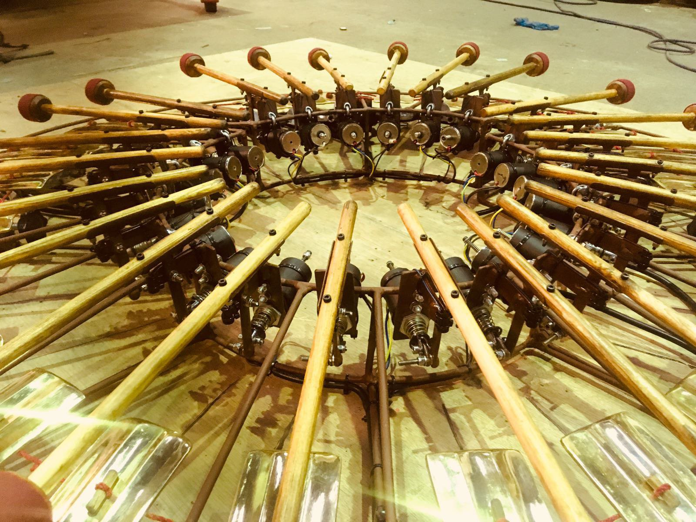
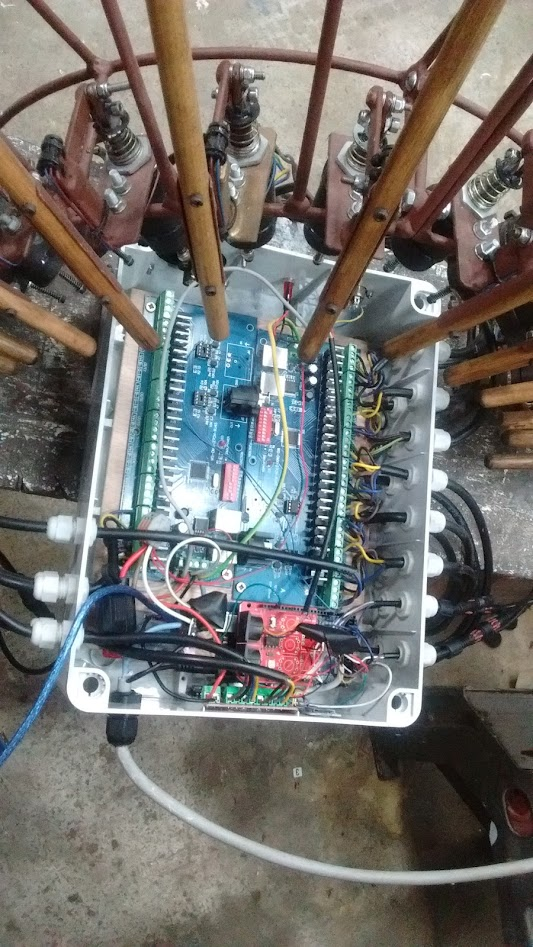

# Hive

Midi controlled, solenoid driven gamelan.

## Hardware

27 channel DMX driver (3A per channel)

Arduino Mega

Solenoids - be careful of maximum current draw!

## Software

Hive_Midi_Gamelan:
Plays one of 16 midi files stored on SD. A track is selected by one of four levers and 'albums' of 4 tracks are selected by a dial

capacitive_midi:
Allows the gamelan to be played by a 24 channel capacitive touch interface

Hive_External_Midi:
Plays incoming midi rather than from file

[Hive - Making Of](https://www.youtube.com/watch?v=dT_0UvmPg9I&t=40s)